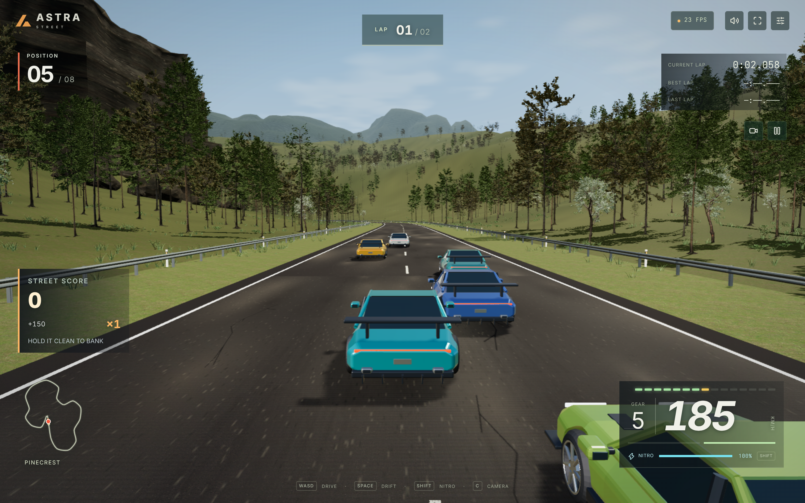
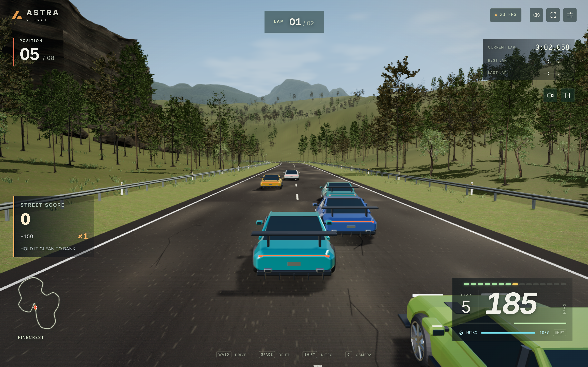
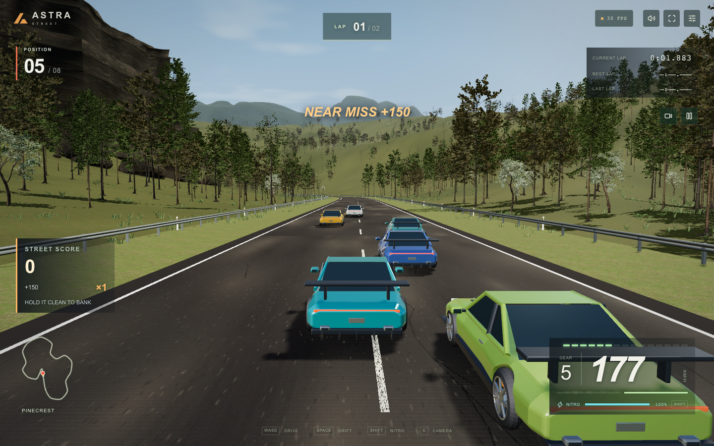
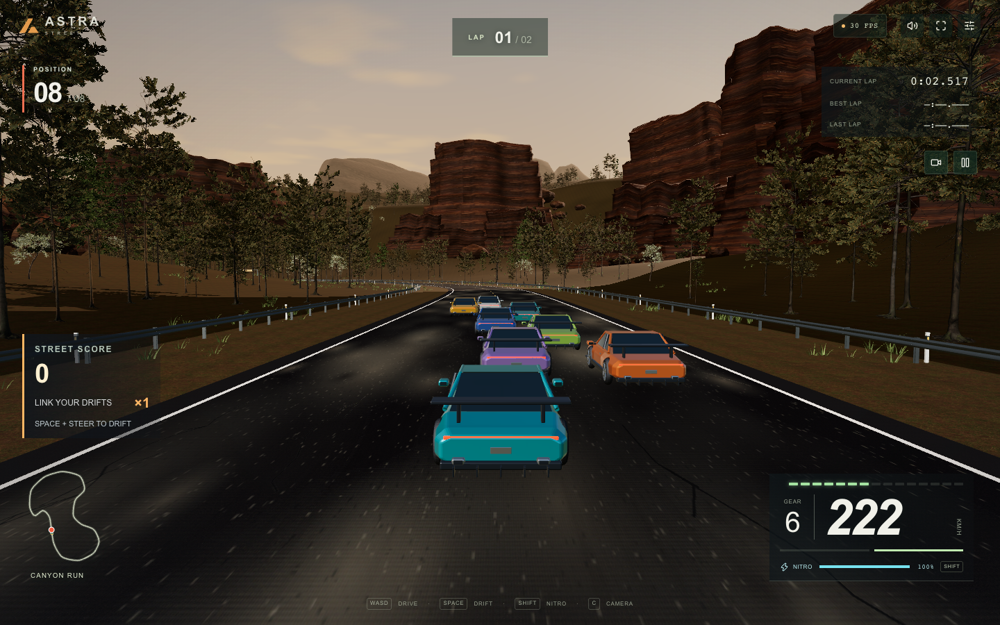
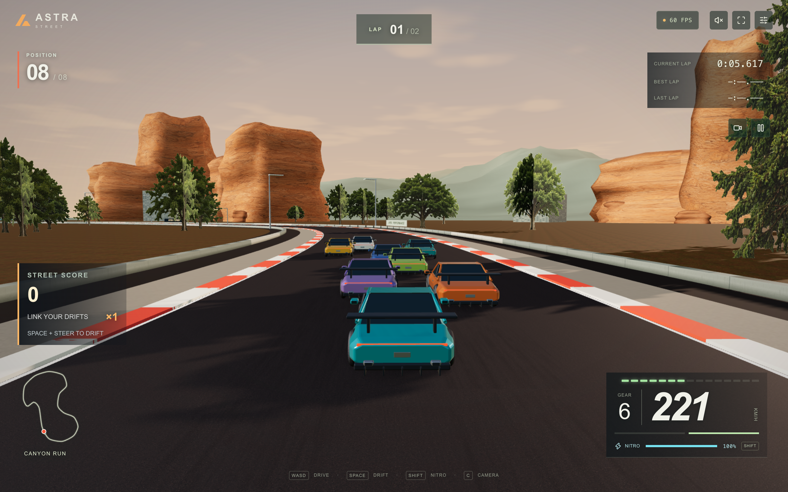
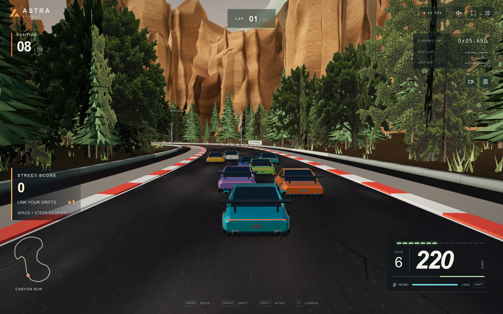

# Landscape frame comparison

The user asked for a substantial graphics/landscape increase and comparison with the [Street Heat reference](https://x.com/higgsfield_ai/status/2095916820431827408). We inspected the supplied clip at four-second intervals and its full-resolution 8-second frame. Reference files remain ignored in `artifacts/reference-street-heat/`; no frame is a runtime asset.

## Broadleaf correction on kyogre — 2026-09-06

The white/cyan broadleaf crowns are corrected by padding unused atlas RGB from UV-verified source colors. Alpha, mapped colors, geometry, trilinear mipmaps and anisotropy are preserved. This exact frozen Pinecrest clear-weather comparison uses the normal contact-shading pipeline at 1675×1047 internal pixels, 1440×900 CSS/DPR2, in dedicated headless Chromium on the Radeon 780M. Screenshot dimensions include emulated DPR; they are not the internal rendering resolution.

| Original atlas | Padded atlas |
| --- | --- |
|  |  |

Six frozen rural route/weather pairs and 62 broadleaf angle/LOD views passed without browser errors. The close model retains its asymmetry and crown gaps; far broadleaf coverage remains about 57% of near coverage in the static fixture, so the earlier density transition remains. See `BROADLEAF-DIAGNOSTIC.md` and `evidence/kyogre-trees/`. Static comparisons do not establish FPS, motion quality or reference parity.

## Historical migration checkpoint

The latest migration checkpoint replaces whole-tree cards with seven 3D tree variants and all-3D LODs, adds scanned rock and forest-floor surfaces, broad terraced cliffs, lower layered mountains and detailed steel roadside furniture. These early development frames show the current source; they are not final release acceptance and are not camera/position-matched to the historical benchmark frames below.

| Pinecrest checkpoint                                              | Canyon checkpoint                                                 |
| ----------------------------------------------------------------- | ----------------------------------------------------------------- |
|  |  |

Near/mid/far crown volume passed controlled all-angle inspection. This earlier checkpoint still had white/cyan in-world broadleaf crowns; the correction above supersedes that defect. The car/city remain simple and the racing surface is flat. No reference parity is claimed.

## Historical version2 comparison

The historical version2 comparison below focuses on chase-view composition, not exact pixels: the reference has a different car, route and camera. The first-release and version2 Astra Street images are both from roughly eight seconds into Canyon Run at the same 1440×900 CSS viewport and DPR 2, with an 1821×1138 internal drawing buffer. Capture timestamps and positions are in `evidence/landscape-mac.json`.

| First release                                      | Landscape pass                                          |
| -------------------------------------------------- | ------------------------------------------------------- |
|  |  |

| Reference observation                                      | Implemented response                                                                                 | Remaining difference                                     |
| ---------------------------------------------------------- | ---------------------------------------------------------------------------------------------------- | -------------------------------------------------------- |
| Rock walls fill the upper view with many overlapping faces | Six fractured profiles, connected buttresses, attached ribs, talus and a higher mountain range       | Repeated profiles and simpler fine fracture detail       |
| Forest appears in dense near/middle/far layers             | Solid roadside conifers, dense distant atlas trees, spatial batches and undergrowth                  | Stylized near branches and crossed cards in the distance |
| The ground has relief and roadside detail                  | A shared terrain height field shapes hills and grounds trees/rocks; grass clumps cover the shoulders | The racing surface remains flat                          |
| Asphalt shows patching and cracks                          | Original seeded wear overlay with small cracks and mottling                                          | Material variety remains more limited                    |

The historical local `artifacts/landscape-comparison.html` displays reference / first release / version2 frames together. `artifacts/control-video/` contains the recorded production keyboard check. These captures use a separate headless Chrome profile after the user requested testing off their screen; WebGL reports ANGLE/Metal on the M4 Max. Headless timing is separate from visible-window display pacing. No new image generation or external runtime asset was required for that older landscape pass.
